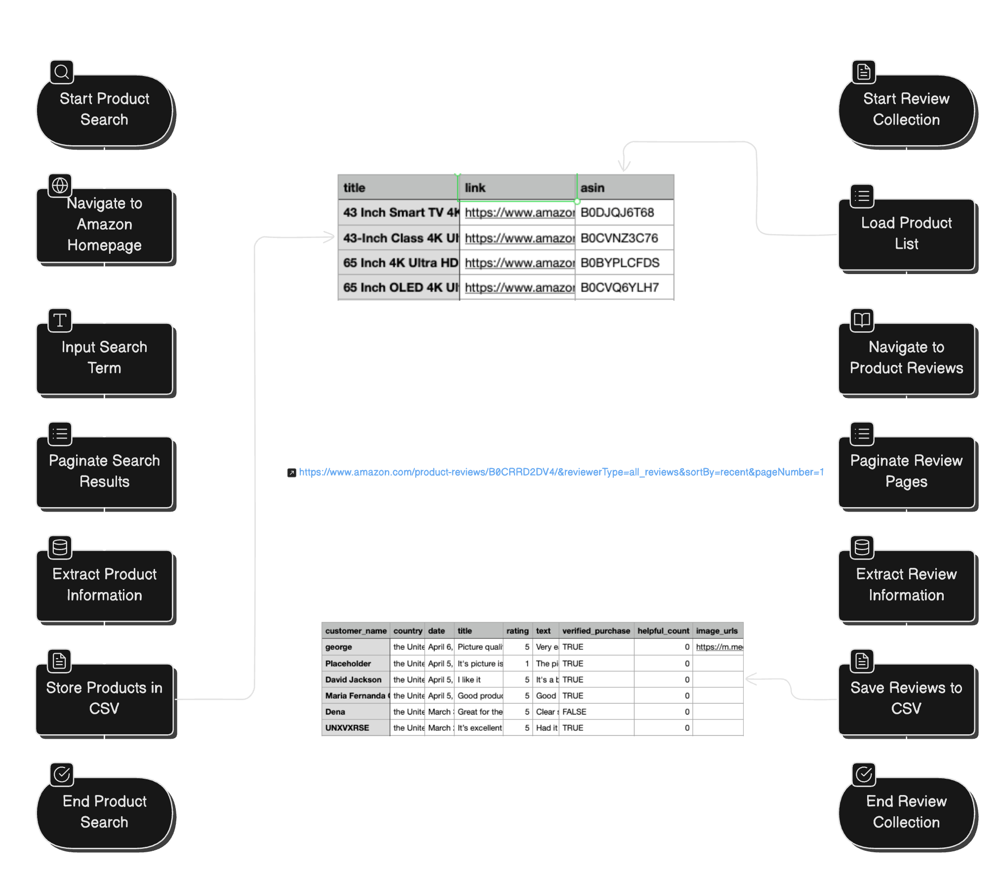

# Amazon Search  Crawler by Keywords

A robust Amazon product and review scraper built with Selenium and Python. This tool enables the automated collection of product information and customer reviews from Amazon's marketplace.

## 📋 Table of Contents
- Technology Stack
- Features
- Installation
- Usage
- Project Structure
- Implementation Process
- Authentication
- Error Handling
- Output


## 🛠️ Technology Stack

- **Python 3.x**: Core programming language
- **Selenium**: Web automation framework for controlling browser interactions
- **ChromeDriver**: WebDriver for Chrome browser automation
- **Pydantic**: Data validation and settings management
- **CSV Module**: For data export to CSV files
- **Logging**: For application logging and debugging

## ✨ Features

- Human-like browsing behavior to minimize detection
- Configurable search parameters
- Extraction of comprehensive product details
- Collection of product reviews with associated metadata
- CSV data export
- Resumable scraping sessions
- Error handling and logging

## 📥 Installation

1. Clone the repository:
```bash
git clone https://github.com/yourusername/whaletv-crawler.git
cd whaletv-crawler
```

2. Install required packages:
```bash
pip install -r requirements.txt
```

3. Make sure you have Chrome browser installed

4. Download ChromeDriver matching your Chrome version from [ChromeDriver Downloads](https://chromedriver.chromium.org/downloads)

## 🚀 Usage

### Command Line Parameters

| Parameter                  | Description                                             | Default          |
|---------------------------|---------------------------------------------------------|------------------|
| `--search`                | Search term to use                                      | "smart tvs"      |
| `--output`                | Output CSV filename                                     | amazon_smarttvs.csv |
| `--reviews`               | Scrape product reviews (flag)                           | False            |
| `--max-products`          | Maximum number of products to process for reviews       | 5                |
| `--max-reviews`           | Maximum number of reviews per product to collect        | 10               |
| `--input-file`            | Input CSV file with product links (if already scraped)  | None             |
| `--use-profile`           | Use your existing Chrome profile with saved logins      | False            |
| `--comments-in-last-n-days`| Number of days to consider for comments                | None (all days)  |

### Example Commands

```bash
# Basic search for smart TVs
python main.py

# Search for specific brand with custom output
python main.py --search "Samsung smart tv" --output samsung_tvs.csv

# Scrape reviews for products (max 10 products, 20 reviews each)
python main.py --reviews --max-products 10 --max-reviews 20

# Process reviews from existing product list
python main.py --input-file existing_products.csv --reviews

# Use existing Chrome profile and limit to recent reviews
python main.py --search "Sony OLED" --reviews --use-profile --comments-in-last-n-days 30 (Not implemented propertly yet!)
```

### Programmatic Usage
```python
from services.amazon_service import AmazonService
from utils.driver_utils import setup_driver

# Initialize the driver
driver = setup_driver(use_profile=True)

# Create Amazon service
amazon = AmazonService(driver)

# Search for products
amazon.perform_search("Smart TVs Sony")

# Extract product data
products = amazon.extract_product_data()

# Save products to CSV
amazon.save_to_csv(products, "smarttvs.csv")

# Extract reviews for a specific product
product = products[0]
amazon.navigate_to_reviews_by_asin(product.asin)
reviews = amazon.extract_reviews(max_reviews=20)

# Save reviews to CSV
amazon.save_reviews_to_csv(product.title, reviews)

# Close the driver
driver.quit()
```

## 📁 Project Structure

```
whaletv-crawler/
├── services/
│   └── amazon_service.py     # Main Amazon scraping service
├── utils/
│   ├── driver_utils.py       # Selenium WebDriver utilities
│   └── security_utils.py     # Security challenge handling
├── py_models/
│   └── amazon_models.py      # Pydantic data models
├── reviews/                  # Directory for saved review data
│   └── reviews_product_*.csv
├── smarttvs.csv              # Saved product data
├── requirements.txt          # Project dependencies
└── READme.md                 # Project documentation
```

## 🔄 Implementation Process



### Phase 1: Product Search and Data Collection


1. The crawler navigates to Amazon's homepage
2. It inputs a search term with human-like typing behavior
3. It paginates through search results, extracting product information:
   - Product title
   - Product URL
   - Amazon Standard Identification Number (ASIN)
4. Products are stored in structured data models and saved to CSV

Code sample for product extraction:
```python
# Search for products
amazon.perform_search("Smart TVs Sony")

# Extract and save product data
products = amazon.extract_product_data()
amazon.save_to_csv(products, "smarttvs.csv")
```

### Phase 2: Review Collection

1. The crawler loads the product list from Phase 1
2. For each product, it navigates to the product's reviews page using the ASIN
3. It paginates through all review pages, extracting:
   - Customer name
   - Country
   - Date
   - Rating
   - Review title and text
   - Helpful vote count
   - Verified purchase status
   - Review images (if present)
4. Reviews are saved in separate CSV files per product

Code sample for review extraction:
```python
# For each product in the CSV
for product in products:
    # Navigate to reviews using ASIN
    amazon.navigate_to_reviews_by_asin(product.asin)
    
    # Extract reviews (optionally limit the number)
    reviews = amazon.extract_reviews(max_reviews=50)
    
    # Save reviews to a dedicated CSV file
    amazon.save_reviews_to_csv(product.title, reviews)
```

## 🔐 Authentication

The tool includes built-in Amazon login functionality when required for accessing review pages:

```python
# Automatic login when prompted
def _handle_login(self, email="your_email@example.com", password="your_password"):
    # Login implementation
```

## ⚠️ Error Handling

The crawler implements robust error handling:
- Automatic retry mechanisms for failed search attempts
- Security challenge detection and handling
- Logging of all exceptions and errors
- Graceful degradation when elements aren't found

## 📊 Output

### Product CSV Format
```
title,link,asin
"43 Inch Smart TV 4K UHD LED...",https://www.amazon.com/...,B0DJQJ6T68
```

### Review CSV Format
```
customer_name,country,date,title,rating,text,verified_purchase,helpful_count,image_urls
"John Smith","the United States","April 6, 2025","Great TV!",5,"Excellent picture quality...",True,12,https://images-na...
```
